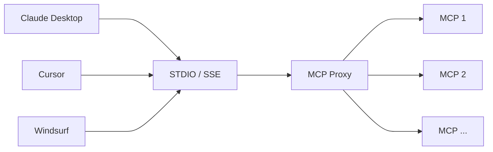

# MCP Proxy

MCP Proxy is a middleware service that enables multiple AI applications (like Claude Desktop, Cursor, and Windsurf) to communicate with different Model Context Protocol (MCP) endpoints through a unified interface. It acts as a proxy layer that:

1. Accepts connections from various AI applications through STDIO or Server-Sent Events (SSE) transport protocols
2. Routes these requests to appropriate MCP endpoints (MCP 1, MCP 2, etc.)
3. Manages and standardizes the communication between AI applications and MCP services

This proxy service simplifies the integration of AI applications with MCP services by providing a centralized connection point and handling the complexity of protocol management and request routing. and request routing.



## Debugging

```shell
npx @modelcontextprotocol/inspector
```
