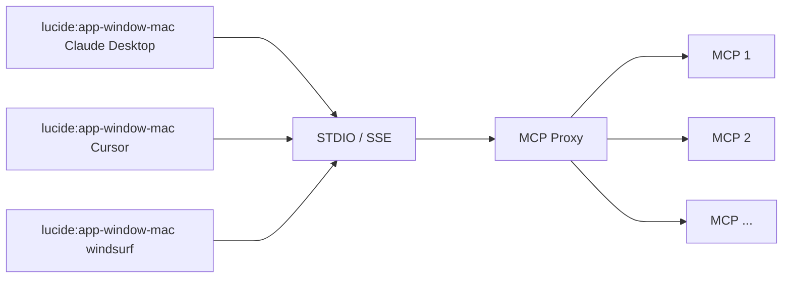

# MCP Proxy


```mermaid
flowchart LR
transport[STDIO / SSE]
c1["lucide:app-window-mac Claude Desktop"] ---> transport
c2["lucide:app-window-mac Cursor"] ---> transport
c3["lucide:app-window-mac windsurf"] ---> transport
transport ---> proxy[MCP Proxy]
proxy ---> mcp1[MCP 1]
proxy ---> mcp2[MCP 2]
proxy ---> mcpn[MCP ...]
```

```shell
npx @modelcontextprotocol/inspector
```